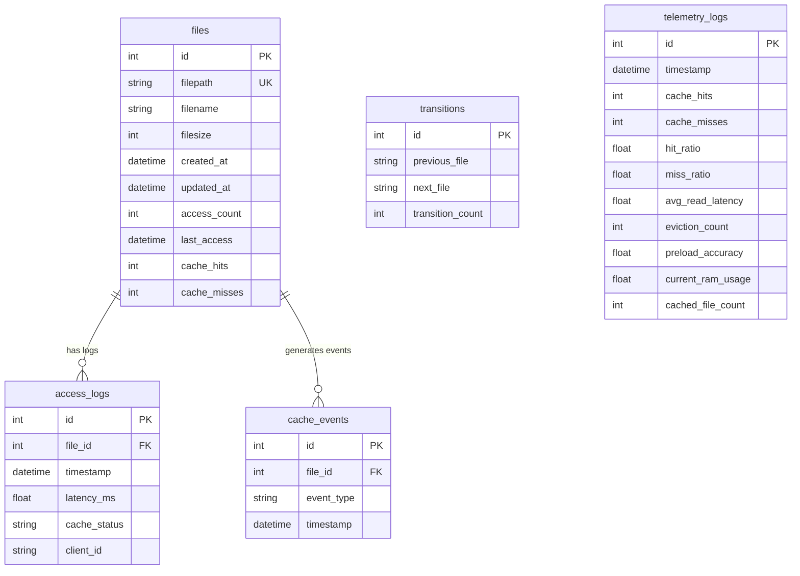

# SmartCache Database Schema Specification

The database maintains file metadata, access logs, Markov state transitions, cache events, and historical telemetry snapshots.

---

## Entity Relationship Diagram (ERD)

