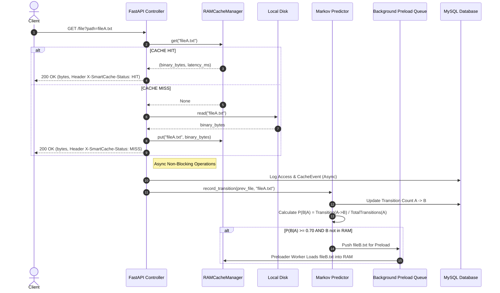

# SmartCache Sequence Diagram

This sequence diagram illustrates the complete flow when a client requests a file via `GET /file`.

```mermaid
sequenceDiagram
    autonumber
    actor Client
    participant API as FastAPI Controller
    participant RAM as RAMCacheManager
    participant Disk as Local Disk
    participant Predictor as Markov Predictor
    participant Queue as Background Preload Queue
    participant DB as MySQL Database

    Client->>API: GET /file?path=fileA.txt
    API->>RAM: get("fileA.txt")
    
    alt CACHE HIT
        RAM-->>API: (binary_bytes, latency_ms)
        API-->>Client: 200 OK (bytes, Header X-SmartCache-Status: HIT)
    else CACHE MISS
        RAM-->>API: None
        API->>Disk: read("fileA.txt")
        Disk-->>API: binary_bytes
        API->>RAM: put("fileA.txt", binary_bytes)
        API-->>Client: 200 OK (bytes, Header X-SmartCache-Status: MISS)
    end

    note right of API: Async Non-Blocking Operations
    API->>DB: Log Access & CacheEvent (Async)
    API->>Predictor: record_transition(prev_file, "fileA.txt")
    Predictor->>DB: Update Transition Count A -> B
    Predictor->>Predictor: Calculate P(B|A) = Transition(A->B) / TotalTransitions(A)
    
    alt P(B|A) >= 0.70 AND B not in RAM
        Predictor->>Queue: Push fileB.txt for Preload
        Queue->>RAM: Preloader Worker Loads fileB.txt into RAM
    end
```
