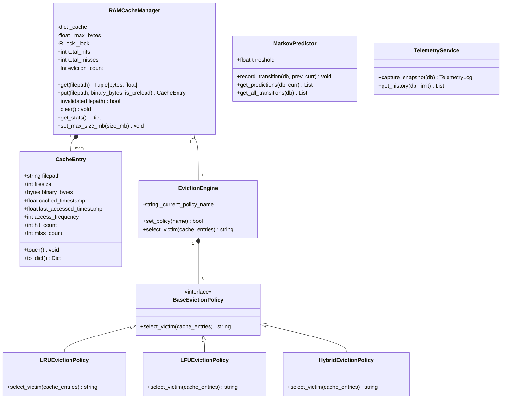

# SmartCache Object-Oriented Class UML Diagram

```mermaid
classDiagram
    class RAMCacheManager {
        -dict _cache
        -float _max_bytes
        -RLock _lock
        +int total_hits
        +int total_misses
        +int eviction_count
        +get(filepath) Tuple[bytes, float]
        +put(filepath, binary_bytes, is_preload) CacheEntry
        +invalidate(filepath) bool
        +clear() void
        +get_stats() Dict
        +set_max_size_mb(size_mb) void
    }

    class CacheEntry {
        +string filepath
        +int filesize
        +bytes binary_bytes
        +float cached_timestamp
        +float last_accessed_timestamp
        +int access_frequency
        +int hit_count
        +int miss_count
        +touch() void
        +to_dict() Dict
    }

    class BaseEvictionPolicy {
        <<interface>>
        +select_victim(cache_entries) string
    }

    class LRUEvictionPolicy {
        +select_victim(cache_entries) string
    }

    class LFUEvictionPolicy {
        +select_victim(cache_entries) string
    }

    class HybridEvictionPolicy {
        +select_victim(cache_entries) string
    }

    class EvictionEngine {
        -string _current_policy_name
        +set_policy(name) bool
        +select_victim(cache_entries) string
    }

    class MarkovPredictor {
        +float threshold
        +record_transition(db, prev, curr) void
        +get_predictions(db, curr) List
        +get_all_transitions(db) List
    }

    class TelemetryService {
        +capture_snapshot(db) TelemetryLog
        +get_history(db, limit) List
    }

    RAMCacheManager "1" *-- "many" CacheEntry
    RAMCacheManager "1" o-- "1" EvictionEngine
    BaseEvictionPolicy <|-- LRUEvictionPolicy
    BaseEvictionPolicy <|-- LFUEvictionPolicy
    BaseEvictionPolicy <|-- HybridEvictionPolicy
    EvictionEngine "1" *-- "3" BaseEvictionPolicy
```
